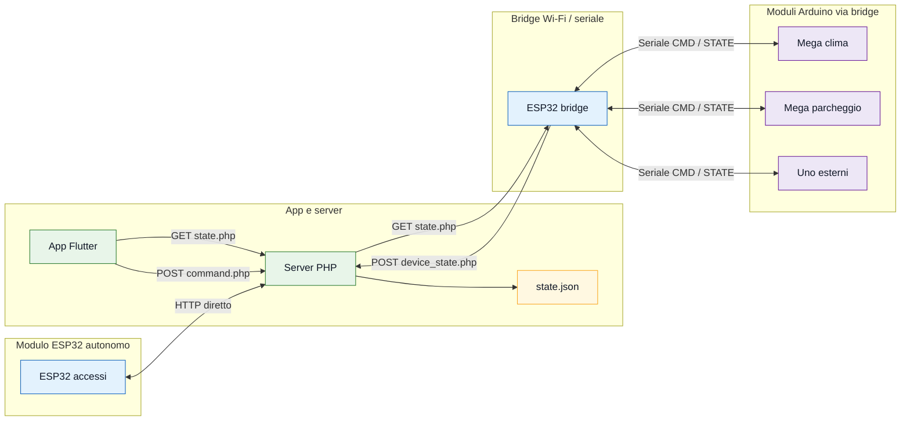
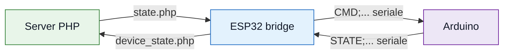

# Schema elettrico

Questo documento e' l'indice generale degli schemi. Gli schemi dettagliati sono
nei README dei singoli moduli, accanto alle rispettive tabelle pin.

## Convenzioni

- Blocchi verdi: app/server.
- Blocchi blu: ESP32.
- Blocchi viola: Arduino.
- Blocchi gialli: sensori.
- Blocchi rossi: attuatori.
- I diagrammi mostrano i collegamenti principali.
- Le tabelle nei README dei moduli indicano i pin esatti.
- Tutti i GND dei moduli collegati tra loro devono essere in comune.

## Schema generale

| Blocco | Ruolo |
| --- | --- |
| App Flutter | Mostra stato e invia comandi |
| Server PHP | Tiene lo stato JSON e riceve comandi/stati |
| ESP32 bridge | Traduce HTTP in seriale per i moduli Arduino |
| Moduli Arduino | Leggono sensori e pilotano attuatori |
| ESP32 accessi | Modulo autonomo con Wi-Fi diretto |

## Dove sono gli schemi dettagliati

| Schema | File |
| --- | --- |
| Partitore 5V -> 3.3V | `firmware/bridge_esp32_server/README.md` |
| Bridge ESP32 <-> Mega | `firmware/bridge_esp32_server/README.md` |
| Bridge ESP32 <-> Uno | `firmware/bridge_esp32_server/README.md` |
| Modulo clima | `firmware/clima_ventola_finestre/README.md` |
| Modulo parcheggio | `firmware/parcheggio_sbarra/README.md` |
| Modulo esterni e tenda | `firmware/esterni_tenda/README.md` |
| Modulo accessi e allarme | `firmware/accessi_allarme/README.md` |
| Modulo luci interne previsto | `firmware/luci_interne/README.md` |

## Protocollo seriale

| Direzione | Esempio |
| --- | --- |
| Bridge -> Arduino | `CMD;fanOn=1;windowsOpen=0;` |
| Bridge -> Arduino | `CMD;playBuzzer=1;buzzerMelody=toreador;buzzerSpeed=125;buzzerEnabled=1;` |
| Arduino -> Bridge | `STATE;temperature=24;humidity=50;fanOn=1;windowsOpen=0;` |
| Arduino -> Bridge | `STATE;parkingBarrierOpen=0;occupiedSpots=3;parkingCapacity=20;` |

## Note per la consegna

- I diagrammi specifici sono dentro i progetti reali, quindi restano vicini al
  codice e alle tabelle pin.
- I nomi nei nodi sono volutamente brevi per evitare sovrapposizioni.
- Il partitore e il GND comune sono le due note elettriche piu' importanti.
- GitHub renderizza automaticamente i diagrammi Mermaid nei file Markdown.

## Riferimenti Mermaid

- [Mermaid flowchart syntax](https://mermaid.js.org/syntax/flowchart.html)
- [Mermaid theme configuration](https://mermaid.js.org/config/theming.html)
- [Mermaid syntax reference](https://mermaid.js.org/intro/syntax-reference.html)
