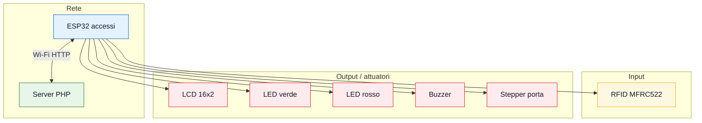

# Accessi e allarme

Modulo ESP32 autonomo per porta interna con RFID, LCD 16x2, LED verde/rosso,
buzzer e motore passo-passo. Questo sketch parla direttamente con il server PHP
via Wi-Fi: non passa dal bridge `bridge_esp32_server`.

## Funzioni

- legge tessere RFID con modulo MFRC522;
- confronta l'UID con una tessera autorizzata;
- sblocca la porta per pochi secondi quando la tessera e' valida;
- mostra stato e messaggi su LCD 16x2;
- accende LED verde/rosso per accesso permesso o negato;
- suona beep brevi per eventi normali;
- dopo troppi accessi negati riproduce una sirena attack-wail tipo 2T22/3T22;
- legge comandi remoti da `state.php`;
- pubblica lo stato reale su `device_state.php`.

## Cosa caricare

Apri in Arduino IDE:

```text
firmware/accessi_allarme/accessi_allarme.ino
```

Scheda:

```text
ESP32 Dev Module
```

Monitor Seriale:

```text
115200 baud
```

## Librerie necessarie

Installa da Gestione librerie:

```text
MFRC522
ArduinoJson
```

Incluse dal core ESP32/Arduino:

```text
WiFi
WiFiClient
WiFiClientSecure
HTTPClient
SPI
Stepper
LiquidCrystal
```

## Configurazione server

Nel file imposta:

```cpp
const char* WIFI_SSID = "NOME_WIFI";
const char* WIFI_PASSWORD = "PASSWORD_WIFI";
const char* SERVER_BASE_URL = "https://TUO_DOMINIO.altervista.org/smart-controller";
```

Non aggiungere `/api`. Lo sketch costruisce da solo:

```text
/api/state.php
/api/device_state.php
```

Con HTTPS lo sketch usa `WiFiClientSecure` con `setInsecure()`, quindi non
verifica il certificato. Va bene per questo progetto scolastico, ma non e' una
configurazione di sicurezza forte.

## Pin hardware



| Componente | Pin ESP32 |
| --- | --- |
| RFID SS/SDA | GPIO5 |
| RFID RST | GPIO22 |
| RFID SCK | GPIO18 |
| RFID MISO | GPIO19 |
| RFID MOSI | GPIO23 |
| LED verde | GPIO32 |
| LED rosso | GPIO33 |
| Buzzer | GPIO26 |
| Stepper porta IN1 | GPIO13 |
| Stepper porta IN2 | GPIO14 |
| Stepper porta IN3 | GPIO12 |
| Stepper porta IN4 | GPIO27 |
| LCD RS | GPIO21 |
| LCD E | GPIO17 |
| LCD D4 | GPIO16 |
| LCD D5 | GPIO4 |
| LCD D6 | GPIO2 |
| LCD D7 | GPIO15 |

## Stepper porta

Il cablaggio fisico del driver ULN2003 resta:

```text
IN1 -> GPIO13
IN2 -> GPIO14
IN3 -> GPIO12
IN4 -> GPIO27
```

Pero' la libreria `Stepper` viene inizializzata nell'ordine:

```cpp
Stepper stepper(PASSI_PER_ROTAZIONE, STEPPER_IN1, STEPPER_IN3, STEPPER_IN2, STEPPER_IN4);
```

Questo e' voluto per i motori 28BYJ-48 + ULN2003. Se il motore vibra ma non
gira, controlla ordine bobine, alimentazione esterna e massa comune.

Valori utili:

```text
PASSI_PER_ROTAZIONE = 2048
PASSI_PORTA = 512
STEPPER_RPM = 6
DOOR_UNLOCK_MS = 2500
```

## Flusso accesso RFID

1. Lo sketch aspetta una card.
2. Stampa l'UID sul Monitor Seriale.
3. Se l'UID corrisponde a `uidAutorizzato`, accende LED verde, suona beep OK e
   apre la porta.
4. Dopo `DOOR_UNLOCK_MS`, la porta viene richiusa.
5. Se l'UID non corrisponde, accende LED rosso e incrementa `deniedAttempts`.
6. Dopo piu' di `MAX_DENIED_ATTEMPTS`, parte la sirena attack-wail e il
   contatore viene azzerato.

UID autorizzato attuale:

```cpp
byte uidAutorizzato[4] = {0xE3, 0x8B, 0x49, 0x1A};
```

Per registrare un'altra tessera, apri il Monitor Seriale, passa la tessera e
copia i byte stampati in `uidAutorizzato`.

## Stato server

Lo sketch legge da `state.php`:

```text
internalDoorUnlocked
rfidReaderEnabled
intrusionAlarmArmed
```

Lo sketch invia a `device_state.php`:

```text
internalDoorUnlocked
intrusionAlarmArmed
rfidReaderEnabled
```

L'app puo' quindi:

- aprire manualmente la porta;
- attivare/disattivare il lettore RFID;
- armare/disarmare l'allarme.

## Tempi

| Costante | Valore | Significato |
| --- | --- | --- |
| `SERVER_PULL_MS` | `1000` | legge il server ogni secondo |
| `SERVER_PUSH_MS` | `1000` | invia lo stato ogni secondo |
| `WIFI_RETRY_MS` | `5000` | ritenta Wi-Fi ogni 5 secondi |
| `STATUS_LOG_MS` | `15000` | riepilogo ogni 15 secondi |
| `DOOR_UNLOCK_MS` | `2500` | porta aperta per 2.5 secondi |
| `MAX_DENIED_ATTEMPTS` | `5` | soglia prima della sirena forte |

## Log utili

All'avvio:

```text
[123 ms] BOOT INFO | accessi_allarme avvio
[124 ms] BOOT PINS | RFID SS=5 RST=22 SCK=18 MISO=19 MOSI=23
```

Riepilogo:

```text
[15000 ms] STATUS INFO | wifi=ok rssi=-54dBm pull=4/0 push=4/0 lastPullHttp=200 lastPushHttp=200 remoteChanges=1 cards=2 allow=1 deny=1 door=0 rfid=1 alarm=1 motor=0 denied=0
```

Cambio remoto:

```text
[18000 ms] REMOTE STATE | rfidReaderEnabled=0
[19000 ms] REMOTE STATE | internalDoorUnlocked=1
```

Accesso negato con sirena:

```text
[32000 ms] ALARM NUCLEAR | troppi accessi negati=6
```

Per log piu' verbosi:

```cpp
const bool DEBUG_VERBOSE = true;
```

Per disattivare il buzzer:

```cpp
const bool BUZZER_ENABLED = false;
```

## Test consigliato

1. Carica lo sketch.
2. Apri il Monitor Seriale a `115200`.
3. Verifica `WIFI OK`.
4. Apri nel browser `.../api/state.php`.
5. Passa una card autorizzata e controlla LED, LCD, motore e JSON.
6. Passa card non autorizzate e controlla `deny`.
7. Dall'app prova `Sblocco Manuale Porta`, `Attiva/Disattiva RFID` e
   `Arma/Disarma allarme`.

## Problemi comuni

- RFID non legge: controlla SPI, alimentazione 3.3V e pin `SS=5`, `RST=22`.
- LCD vuoto: controlla RS/E/D4-D7, contrasto e alimentazione.
- Motore vibra: controlla ordine bobine, alimentatore esterno e GND comune.
- Wi-Fi non si collega: controlla rete 2.4 GHz, SSID e password.
- Server non aggiorna: controlla URL base, `device_state.php` e permessi di
  `storage/state.json`.
