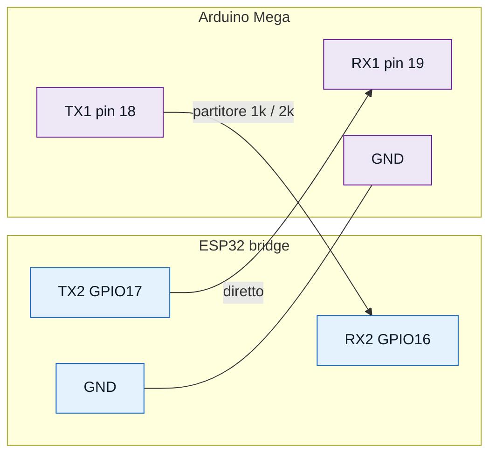
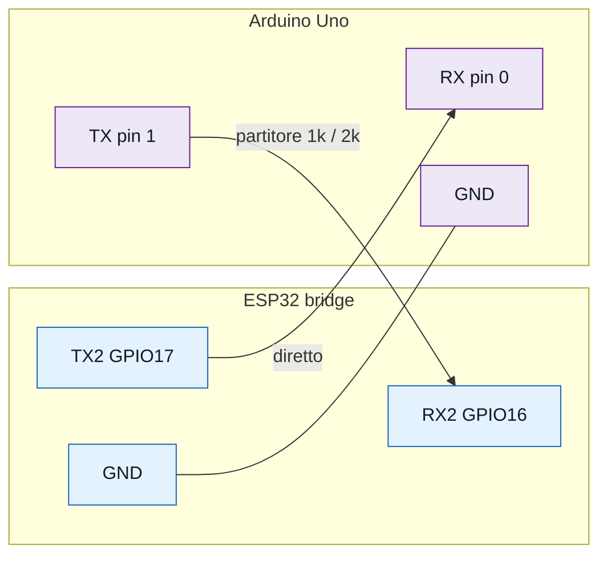
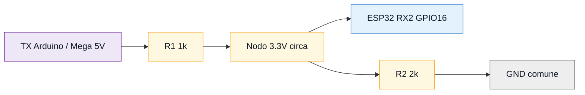

# Bridge ESP32 server

Sketch ESP32 che collega il server PHP ai moduli Arduino Uno/Mega. Il bridge
usa Wi-Fi verso il server e `Serial2` verso l'Arduino.

```text
App Flutter <-> Server PHP <-> ESP32 bridge <-> Arduino Uno/Mega
```

`accessi_allarme` non usa questo bridge: e' un modulo ESP32 autonomo.

## Funzioni

- si collega al Wi-Fi;
- legge `GET /api/state.php`;
- converte lo stato desiderato in righe `CMD;...`;
- invia i comandi al modulo Arduino su `Serial2`;
- legge righe `STATE;...` dall'Arduino;
- pubblica lo stato reale con `POST /api/device_state.php`;
- scansiona automaticamente `9600` e `57600` baud;
- stampa riepiloghi diagnostici ogni 15 secondi.

## Cosa caricare

Apri:

```text
firmware/bridge_esp32_server/bridge_esp32_server.ino
```

Scheda:

```text
ESP32 Dev Module
```

Monitor Seriale:

```text
115200 baud
```

## Librerie

Installa:

```text
ArduinoJson
```

Incluse dal core ESP32:

```text
WiFi
WiFiClientSecure
HTTPClient
```

## Configurazione Wi-Fi e server

Nel file cambia:

```cpp
const char* WIFI_SSID = "NOME_WIFI";
const char* WIFI_PASSWORD = "PASSWORD_WIFI";
const char* SERVER_BASE_URL = "https://TUO_DOMINIO.altervista.org/smart-controller";
```

Non mettere `/public_html`, `/api`, `/state.php` o slash finale obbligatorio.
Lo sketch aggiunge da solo:

```text
/api/state.php
/api/device_state.php
```

## Pin ESP32

| Funzione | Pin ESP32 |
| --- | --- |
| RX2 dal TX Arduino | GPIO16 |
| TX2 verso RX Arduino | GPIO17 |
| Massa comune | GND |

Nel codice:

```cpp
const uint8_t ESP_RX_PIN = 16;
const uint8_t ESP_TX_PIN = 17;
const unsigned long BAUD_RATES[] = {9600UL, 57600UL};
```

## Collegamento con Arduino Mega

Per `clima_ventola_finestre` e `parcheggio_sbarra`:



```text
ESP32 TX2 GPIO17 -> Mega RX1 pin 19
Mega TX1 pin 18 -> partitore 1k/2k -> ESP32 RX2 GPIO16
GND ESP32 -> GND Mega
```

## Collegamento con Arduino Uno

Per `esterni_tenda`:



```text
ESP32 TX2 GPIO17 -> Arduino RX pin 0
Arduino TX pin 1 -> partitore 1k/2k -> ESP32 RX2 GPIO16
GND ESP32 -> GND Arduino
```

Scollega i fili dai pin `0/1` mentre carichi lo sketch sull'Arduino Uno.

## Partitore

Sul segnale Arduino/Mega TX -> ESP32 RX usa:



```text
TX Arduino/Mega -> 1k -> nodo -> ESP32 RX2 GPIO16
nodo -> 2k -> GND
GND Arduino/Mega -> GND ESP32
```

Non collegare direttamente un TX a 5V all'RX dell'ESP32.

## Protocollo

Arduino verso bridge:

```text
STATE;temperature=24;humidity=52;fanOn=1;windowsOpen=0;
STATE;parkingBarrierOpen=0;occupiedSpots=3;parkingCapacity=20;
STATE;twilightDetected=1;exteriorLightsOn=1;awningOpen=0;
```

Bridge verso Arduino:

```text
CMD;fanOn=1;windowsOpen=0;
CMD;parkingBarrierOpen=1;rfidReaderEnabled=1;
CMD;exteriorLightsOn=1;awningOpen=0;
CMD;playBuzzer=1;buzzerMelody=toreador;buzzerSpeed=125;buzzerEnabled=1;
```

Il bridge ignora testo sporco prima di `STATE;`, utile quando la seriale riceve
rumore da motori o reset.

## Campi gestiti

Stato letto da Arduino e postato al server:

```text
temperature
humidity
sensorOk
fanOn
fanPower
fanPwm
windowsOpen
internalDoorUnlocked
intrusionAlarmArmed
rfidReaderEnabled
lcdEnabled
remoteOverride
occupiedSpots
parkingCapacity
parkingBarrierOpen
vehicleDetected
twilightDetected
exteriorLightsOn
awningOpen
motionDetected
indoorLightsOn
```

Comandi letti dal server e inoltrati ad Arduino:

```text
fanOn
windowsOpen
lcdEnabled
internalDoorUnlocked
intrusionAlarmArmed
rfidReaderEnabled
parkingBarrierOpen
parkingCapacity
occupiedSpots
exteriorLightsOn
awningOpen
indoorLightsOn
playBuzzer
buzzerMelody
buzzerSpeed
buzzerEnabled
doomBuzzerEnabled
```

`buzzerRequestId` serve solo al bridge per capire se deve inoltrare un nuovo
comando buzzer. Se l'id non aumenta, il bridge non ripete la stessa melodia.

## Come provarlo

1. Carica il bridge sull'ESP32.
2. Apri Monitor Seriale a `115200`.
3. Verifica connessione Wi-Fi.
4. Apri nel browser `.../api/state.php`.
5. Collega un modulo Arduino che invia `STATE;...`.
6. Aspetta il lock baud: `baud=9600 locked` o `baud=57600 locked`.
7. Invia un comando dall'app e controlla `Inviato CMD ad Arduino`.

## Log utili

All'avvio:

```text
[123 ms] [SERIAL] Ascolto Arduino a baud 9600
[456 ms] [WIFI] Connesso! IP: 192.168.1.50
```

Riga `STATE` valida:

```text
[12345 ms] [SERIAL] Ricevuto STATE da Arduino baud=57600 T=27.0 H=62 fan=1 win=0 park=0/32 lights=0 ...
```

Riepilogo:

```text
[30000 ms] [STATUS] wifi=ok arduino=ok baud=57600 locked state=4 ignored=0 cmd=2 pull=4/0 push=4/0 lastHttp=200/200
```

Push saltato:

```text
[15000 ms] [HTTP] PUSH saltato: nessun byte ricevuto da Arduino
```

Byte ricevuti ma niente `STATE;`:

```text
[15000 ms] [HTTP] PUSH saltato: byte da Arduino ricevuti, ma nessuna riga STATE valida.
```

Errore server:

```text
[12000 ms] [HTTP] Errore Push: 500
```

Per log completi:

```cpp
const bool DEBUG_VERBOSE = true;
```

## Diagnostica rapida

| Sintomo | Significato | Controllo |
| --- | --- | --- |
| `wifi=down` | Wi-Fi non connesso | SSID, password, rete 2.4 GHz |
| `arduino=waiting` | nessun byte seriale | TX/RX/GND, sketch Arduino |
| `arduino=noise` | byte senza `STATE;` | baud, fili invertiti, rumore |
| `baud=... scanning` | non ha ancora trovato baud valido | aspetta o controlla modulo |
| `lastHttp=200/500` | pull ok, push fallisce | `device_state.php`, storage |
| `pull=0/N` | non legge server | URL, Wi-Fi, HTTPS |
| `push=0/N` | non scrive server | PHP, permessi, JSON |

## Problemi comuni

- Upload ESP32 bloccato: chiudi Monitor Seriale, scollega GPIO16/GPIO17, premi
  `BOOT` se resta su `Connecting...`.
- Non riceve Arduino Mega: controlla `TX1=18`, `RX1=19`, GND e partitore.
- Non riceve Arduino Uno: controlla pin `0/1` e scollegali durante upload.
- Server non risponde: apri `state.php` dal browser e controlla URL base.
- Comando buzzer non parte: controlla che `buzzerRequestId` aumenti nel JSON.
- Dati app fermi: controlla `lastUpdated` in `state.php` e `push` nei log.
