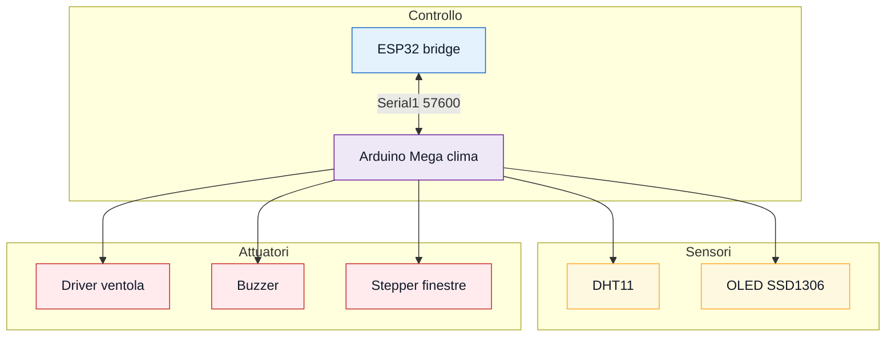

# Temperatura, umidita', ventola e finestre

Modulo Arduino Mega per DHT11, display OLED SSD1306, ventola, finestre/sportello
con stepper e buzzer con piu' melodie. Comunica con il server tramite
`bridge_esp32_server` su `Serial1`.

## Funzioni

- legge temperatura e umidita' dal DHT11;
- mostra dashboard su OLED SSD1306;
- accende/spegne ventola in automatico o da comando app;
- apre/chiude finestre con stepper;
- riceve e applica comandi `CMD;...` dal bridge;
- invia stato `STATE;...` al bridge;
- riproduce melodie buzzer selezionate dall'app;
- permette stop del buzzer durante la riproduzione;
- mantiene alcuni campi degli altri moduli per stato aggregato app/server.

## Cosa caricare

Apri:

```text
firmware/clima_ventola_finestre/clima_ventola_finestre.ino
```

Scheda:

```text
Arduino Mega or Mega 2560
```

Monitor Seriale:

```text
115200 baud
```

Seriale verso ESP32:

```text
Serial1 a 57600 baud
```

## Librerie

Installa:

```text
DHT11
Adafruit GFX Library
Adafruit SSD1306
```

Incluse nell'IDE:

```text
Wire
Stepper
```

## Pin hardware



| Componente | Pin Mega |
| --- | --- |
| OLED SSD1306 SDA | 20 |
| OLED SSD1306 SCL | 21 |
| DHT11 DATA | 8 |
| Ventola / driver ventola | 9 |
| Buzzer | 10 |
| Stepper finestre IN1 | A0 |
| Stepper finestre IN2 | A2 |
| Stepper finestre IN3 | A1 |
| Stepper finestre IN4 | A3 |

Pin I2C tipici:

| Scheda | SDA | SCL |
| --- | --- | --- |
| Arduino Uno/Nano | A4 | A5 |
| Arduino Mega | 20 | 21 |

## Collegamento con ESP32 bridge

```text
ESP32 TX2 GPIO17 -> Mega RX1 pin 19
Mega TX1 pin 18 -> partitore 1k/2k -> ESP32 RX2 GPIO16
GND ESP32 -> GND Mega
```

Lo sketch usa:

```cpp
#define espLink Serial1
espLink.begin(57600);
```

## Parametri principali

| Costante | Valore | Significato |
| --- | --- | --- |
| `FAN_ACTIVE_LOW` | `false` | cambia se il driver ventola e' active-low |
| `FAN_RUN_POWER` | `160` | potenza normale ventola |
| `FAN_START_POWER` | `160` | boost iniziale ventola |
| `FAN_START_BOOST_MS` | `900` | durata boost |
| `FAN_SELF_TEST_ON_BOOT` | `false` | test ventola all'avvio disattivato |
| `SOGLIA_VENTOLA_ON` | `24` | accensione automatica ventola |
| `SOGLIA_VENTOLA_OFF` | `23` | spegnimento automatico ventola |
| `SENSOR_INTERVAL_MS` | `2000` | lettura DHT11 |
| `STATE_INTERVAL_MS` | `2000` | invio `STATE;...` |
| `TIMEOUT_COMANDI` | `10000` | durata override remoto |
| `BUZZER_COOLDOWN_MS` | `650` | anti-spam buzzer |
| `OLED_EXTREME_FX` | `false` | effetti OLED pesanti disattivati |

Se la ventola non parte, prova prima alimentazione/GND/MOSFET. Se il driver e'
active-low, cambia:

```cpp
const bool FAN_ACTIVE_LOW = true;
```

## Stato automatico e override remoto

In automatico:

```text
temperatura >= 24 C -> ventola ON
temperatura <= 23 C -> ventola OFF
```

Quando arriva un comando `fanOn` o `windowsOpen`, lo sketch entra in override
remoto per circa 10 secondi. In quel periodo la logica automatica non ribalta
subito il comando dell'app.

## Stato inviato al bridge

Esempio:

```text
STATE;temperature=24;humidity=50;sensorOk=1;fanOn=1;fanPower=160;fanPwm=160;windowsOpen=0;internalDoorUnlocked=0;lcdEnabled=1;remoteOverride=0;module=clima;board=mega;uptimeMs=123456;
```

Campi principali:

| Campo | Significato |
| --- | --- |
| `temperature` | temperatura letta |
| `humidity` | umidita' letta |
| `sensorOk` | DHT11 valido |
| `fanOn` | ventola attiva |
| `fanPower` | potenza logica |
| `fanPwm` | valore PWM scritto |
| `windowsOpen` | finestre aperte |
| `lcdEnabled` | OLED/logica display attiva |
| `remoteOverride` | comando remoto ancora valido |
| `module` | `clima` |
| `board` | `mega` |
| `uptimeMs` | millisecondi da avvio |

Lo sketch mantiene anche campi di altri moduli (`internalDoorUnlocked`,
`rfidReaderEnabled`, `parkingBarrierOpen`, ecc.) quando arrivano nel comando,
cosi' lo stato aggregato resta coerente.

## Comandi ricevuti

Esempi:

```text
CMD;fanOn=1;windowsOpen=0;
CMD;lcdEnabled=1;
CMD;playBuzzer=1;buzzerMelody=musicBox;buzzerSpeed=100;buzzerEnabled=1;
CMD;playBuzzer=1;buzzerEnabled=0;doomBuzzerEnabled=0;
```

Campi clima:

```text
fanOn
windowsOpen
lcdEnabled
```

Campi buzzer:

```text
playBuzzer
buzzerMelody
buzzerSpeed
buzzerEnabled
doomBuzzerEnabled
```

`buzzerSpeed` viene limitato a `50..200`.

## Buzzer

Melodie accettate:

| Valore `buzzerMelody` | Effetto |
| --- | --- |
| `doom` | riff Doom / At Doom's Gate |
| `musicBox` | Grandfather Clock stile music box |
| `toreador` | Toreador March |
| `mega` | Megalovania breve |
| `siren118` | sirena 118 bitonale |

Il firmware controlla i comandi in `waitBuzzerDuration()`, quindi uno stop
remoto puo' interrompere una melodia mentre sta suonando.

Per disattivare completamente il buzzer:

```cpp
const bool BUZZER_ENABLED = false;
```

## OLED

La schermata principale mostra:

- temperatura e umidita';
- stato DHT;
- stato ventola;
- stato finestre;
- modalita' `AUTO` o `ESP32`;
- tracciato grafico storico;
- schermata dedicata in caso di errore DHT.

Ottimizzazioni attive:

```text
SSD1306_NO_SPLASH
HISTORY_SIZE = 48
OLED_EXTREME_FX = false
FAN_SELF_TEST_ON_BOOT = false
```

Gli effetti OLED pesanti sono lasciati opt-in per non consumare troppa flash.

## Log utili

Riepilogo:

```text
[CLIMA STATUS] dht=ok temp=24C hum=52% fan=on power=160 pwm=160 windows=closed mode=auto tx=10 cmd=2 ignored=0
```

Comando ricevuto:

```text
[ESP32 CMD] CMD;fanOn=1;windowsOpen=0;
```

Invio stato con debug:

```text
[SERIAL1 TX] STATE;temperature=24;humidity=52;...
```

Per log piu' verbosi:

```cpp
const bool DEBUG_VERBOSE = true;
```

## Test consigliato

1. Carica lo sketch sul Mega.
2. Apri il Monitor Seriale a `115200`.
3. Verifica che compaia `display pronto`.
4. Controlla OLED, temperatura e umidita'.
5. Scalda leggermente il DHT11: la ventola deve accendersi sopra soglia.
6. Dall'app prova `Controllo Ventola` e `Gestione Finestre`.
7. Prova una melodia e poi `Stop`.
8. Controlla sul Monitor Seriale ESP32 che il bridge riceva `STATE;...`.

## Problemi comuni

- OLED spento: controlla indirizzo `0x3C`, SDA/SCL, VCC/GND.
- DHT11 in errore: controlla alimentazione e pin dati `8`.
- Ventola sempre accesa: controlla `FAN_ACTIVE_LOW`, MOSFET/driver e GND.
- Stop buzzer lento: controlla che il bridge invii `buzzerEnabled=0` con nuovo
  `buzzerRequestId`.
- ESP32 non riceve: controlla `Serial1`, baud `57600`, partitore e GND comune.
- Sketch troppo pesante: lascia `OLED_EXTREME_FX=false` e
  `FAN_SELF_TEST_ON_BOOT=false`.
