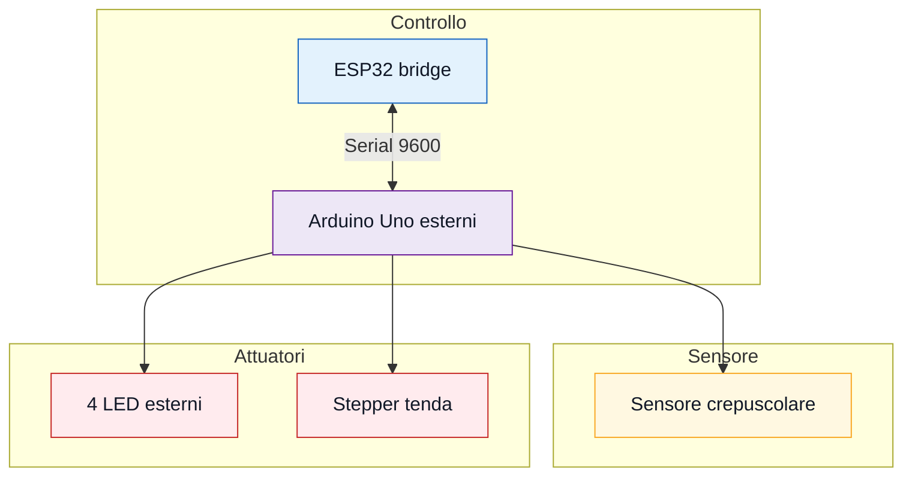

# Luci esterne e tenda

Modulo Arduino Uno/compatibile per sensore crepuscolare, quattro LED esterni e
tenda con motore passo-passo. Comunica con il bridge ESP32 usando la seriale
hardware dell'Arduino (`Serial` sui pin 0/1).

## Funzioni

- legge il sensore crepuscolare su `A0`;
- considera notte sopra `sogliaBuio = 600`;
- considera giorno sotto `sogliaLuce = 400`;
- accende/spegne i LED esterni;
- apre/chiude la tenda con stepper;
- accetta override remoto per luci e tenda;
- dopo 10 secondi senza comandi torna alla logica automatica;
- invia stato al bridge ogni secondo.

## Cosa caricare

Apri:

```text
firmware/esterni_tenda/esterni_tenda.ino
```

Scheda:

```text
Arduino Uno
```

o una scheda compatibile con i pin usati.

## Librerie

Non servono librerie esterne. Lo sketch usa:

```text
Stepper
```

## Pin hardware



| Funzione | Pin |
| --- | --- |
| Sensore crepuscolare | A0 |
| LED esterno 1 | 2 |
| LED esterno 2 | 3 |
| LED esterno 3 | 4 |
| LED esterno 4 | 5 |
| Stepper tenda IN1 | 8 |
| Stepper tenda IN2 | 10 |
| Stepper tenda IN3 | 9 |
| Stepper tenda IN4 | 11 |

## Collegamento con ESP32 bridge

```text
ESP32 TX2 GPIO17 -> Arduino RX pin 0
Arduino TX pin 1 -> partitore 1k/2k -> ESP32 RX2 GPIO16
GND ESP32 -> GND Arduino
```

Importante: scollega i fili dai pin `0/1` quando carichi lo sketch
sull'Arduino, altrimenti l'upload puo' fallire.

## Parametri importanti

```text
LINK_BAUD = 9600
SEND_STATE_MS = 1000
COMMAND_TIMEOUT_MS = 10000
DEBUG_STATUS_MS = 10000
sogliaBuio = 600
sogliaLuce = 400
posizioneChiusa = passiPerGiro * 2
```

`DEBUG_TO_SERIAL` deve restare `false` quando l'ESP32 e' collegato, perche' la
stessa seriale e' usata dal bridge.

## Logica automatica

Se non arrivano comandi dal bridge per 10 secondi:

```text
A0 > 600  -> twilightDetected=1, luci ON, tenda chiusa
A0 < 400  -> twilightDetected=0, luci OFF, tenda aperta
```

Tra 400 e 600 lo stato resta quello precedente, cosi' non cambia continuamente
quando la luce e' instabile.

## Stato inviato al bridge

```text
STATE;twilightDetected=1;exteriorLightsOn=1;awningOpen=0;
```

Campi:

| Campo | Significato |
| --- | --- |
| `twilightDetected` | il sensore vede buio/notte |
| `exteriorLightsOn` | LED esterni accesi |
| `awningOpen` | tenda aperta |

## Comandi ricevuti

```text
CMD;exteriorLightsOn=1;awningOpen=0;
```

Se arriva un comando, lo sketch applica manualmente luci/tenda e aggiorna
`lastCommandReceived`. Dopo `COMMAND_TIMEOUT_MS` torna automatico.

## Test consigliato

1. Scollega ESP32 dai pin 0/1.
2. Carica lo sketch su Arduino.
3. Ricollega ESP32 ai pin 0/1.
4. Copri il sensore crepuscolare: LED accesi e tenda chiusa.
5. Illumina il sensore: LED spenti e tenda aperta.
6. Dall'app prova `Illuminazione Esterna` e `Muovi Tenda`.

## Problemi comuni

- Upload fallisce: scollega pin 0/1 dal bridge.
- Giorno/notte invertiti: cambia soglie o cablaggio del sensore.
- Tenda gira al contrario: inverti il segno in `updateAwningMotor()`.
- ESP32 non riceve: controlla TX/RX, GND e partitore sul pin 1.
- Debug non appare: `DEBUG_TO_SERIAL=false` e' voluto quando il bridge e'
  collegato.
