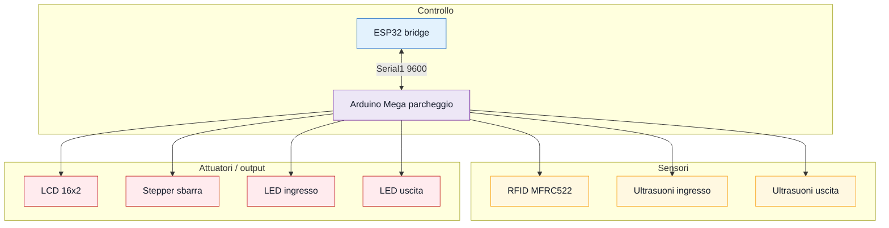

# Parcheggio e sbarra

Modulo Arduino Mega per ingresso/uscita parcheggio con RFID, due sensori a
ultrasuoni, LCD 16x2, LED di rilevamento e sbarra motorizzata.

Il modulo non usa Wi-Fi direttamente: comunica con `bridge_esp32_server` tramite
`Serial1`.

## Funzioni

- rileva auto in ingresso e uscita con ultrasuoni;
- abilita ingresso solo se ci sono posti liberi;
- aspetta una card RFID valida per aprire la sbarra in ingresso;
- apre automaticamente la sbarra in uscita;
- aggiorna `occupiedSpots` e `parkingCapacity`;
- mostra messaggi su LCD;
- invia stato al bridge ogni secondo;
- riceve comandi `CMD;...` dal bridge.

## Cosa caricare

Apri:

```text
firmware/parcheggio_sbarra/parcheggio_sbarra.ino
```

Scheda:

```text
Arduino Mega or Mega 2560
```

Monitor Seriale:

```text
115200 baud
```

Seriale verso ESP32:

```text
Serial1 a 9600 baud
```

## Librerie

Installa:

```text
MFRC522
```

Incluse nell'IDE:

```text
SPI
LiquidCrystal
Stepper
```

## Pin hardware



| Funzione | Pin Mega |
| --- | --- |
| RFID SS/SDA | 53 |
| RFID RST | 30 |
| LCD RS | 31 |
| LCD E | 33 |
| LCD D4 | 35 |
| LCD D5 | 37 |
| LCD D6 | 39 |
| LCD D7 | 41 |
| Stepper sbarra IN1 | 11 |
| Stepper sbarra IN2 | 9 |
| Stepper sbarra IN3 | 10 |
| Stepper sbarra IN4 | 8 |
| Ultrasuoni ingresso TRIG | 2 |
| Ultrasuoni ingresso ECHO | 3 |
| LED ingresso | 5 |
| Ultrasuoni uscita TRIG | 13 |
| Ultrasuoni uscita ECHO | 12 |
| LED uscita | 4 |

## Collegamento con ESP32 bridge

```text
ESP32 TX2 GPIO17 -> Mega RX1 pin 19
Mega TX1 pin 18 -> partitore 1k/2k -> ESP32 RX2 GPIO16
GND ESP32 -> GND Mega
```

Il partitore serve solo sul segnale `Mega TX1 -> ESP32 RX2`.

## Parametri importanti

```text
LINK_BAUD = 9600
SEND_STATE_MS = 1000
DEBUG_STATUS_MS = 10000
MAX_POSTI = 20
sogliaDistanza = 15 cm
passiSbarra = 512
```

## Stato inviato al bridge

Ogni secondo invia:

```text
STATE;rfidReaderEnabled=1;parkingBarrierOpen=0;vehicleDetected=0;parkingCapacity=20;occupiedSpots=3;lcdEnabled=1;
```

Campi:

| Campo | Significato |
| --- | --- |
| `rfidReaderEnabled` | lettore RFID abilitato |
| `parkingBarrierOpen` | sbarra aperta |
| `vehicleDetected` | almeno un ultrasuoni rileva veicolo |
| `parkingCapacity` | capienza totale |
| `occupiedSpots` | posti occupati |
| `lcdEnabled` | LCD attivo |

## Comandi ricevuti

Lo sketch legge righe come:

```text
CMD;parkingBarrierOpen=1;rfidReaderEnabled=1;lcdEnabled=1;parkingCapacity=20;occupiedSpots=3;
```

Campi applicati:

```text
rfidReaderEnabled
lcdEnabled
parkingCapacity
occupiedSpots
parkingBarrierOpen
```

Se `parkingBarrierOpen` cambia, lo sketch chiama `apriSbarra()` o
`chiudiSbarra()`.

## Flusso ingresso

1. Sensore ingresso sotto `15 cm`.
2. LCD mostra `Auto ingresso`.
3. Se `rfidReaderEnabled=1`, aspetta una card.
4. Card letta: apre la sbarra.
5. Aspetta passaggio sul sensore uscita.
6. Chiude la sbarra.
7. Incrementa `occupiedSpots`.

## Flusso uscita

1. Sensore uscita sotto `15 cm`.
2. Apre la sbarra.
3. Aspetta passaggio verso ingresso.
4. Chiude la sbarra.
5. Decrementa `occupiedSpots`.

## Log utili

All'avvio:

```text
[123 ms] PARK BOOT INFO | parcheggio_sbarra pronto
[124 ms] PARK BOOT BAUD | 9600
```

Stato:

```text
[10000 ms] PARK STATUS INFO | spots=3/20 free=17 barrier=0 vehicle=0 rfid=1 lcd=1 tx=10 cmd=2 ignored=0 d1=100 d2=100
```

Comando ricevuto:

```text
[12000 ms] PARK CMD RX | CMD;parkingBarrierOpen=1;
```

## Test consigliato

1. Carica lo sketch sul Mega.
2. Apri Monitor Seriale a `115200`.
3. Verifica messaggi `BOOT`.
4. Avvicina un oggetto al sensore ingresso.
5. Passa una card RFID.
6. Controlla apertura/chiusura sbarra e conteggio posti.
7. Collega il bridge e controlla che l'app aggiorni `Posti Liberi` e `Sbarra`.

## Problemi comuni

- RFID non legge: controlla `SS/SDA 53`, `RST 30`, SPI e alimentazione.
- LCD mostra caratteri strani: controlla pin RS/E/D4-D7 e contrasto.
- Sbarra gira al contrario: inverti il segno in `apriSbarra()` e
  `chiudiSbarra()`.
- Conteggio sbagliato: controlla orientamento dei due sensori ultrasuoni.
- ESP32 non riceve: controlla `TX1 pin 18`, `RX1 pin 19`, GND e partitore.
